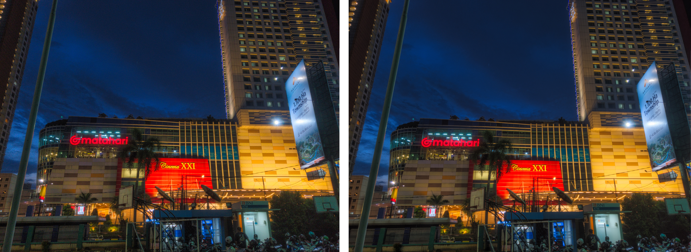
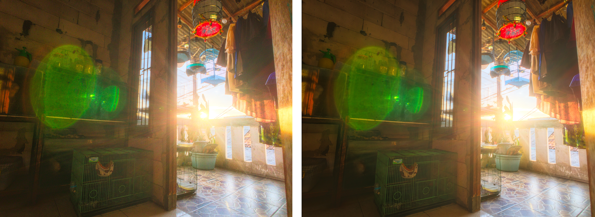
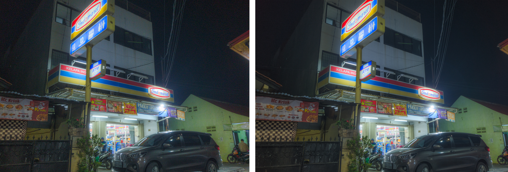
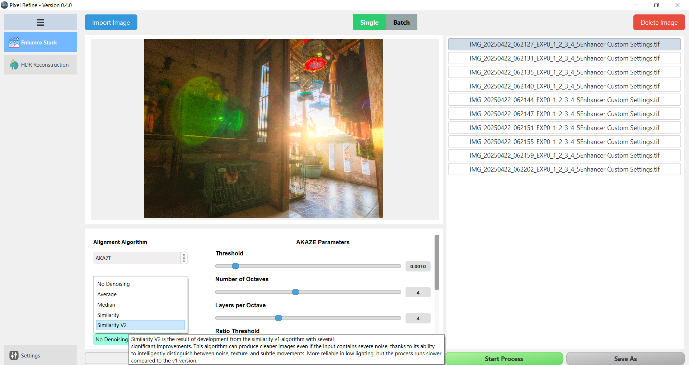
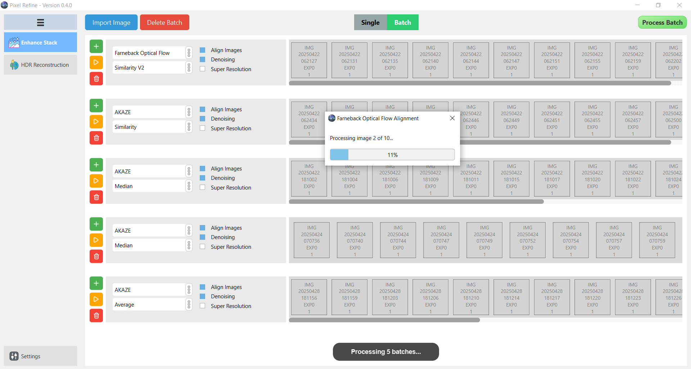

<h2 align="center"> Pixel Refine </h2>

A computational photography tool.

---

## 👋 Introduction

**Pixel Refine** is designed to reduce noise and enhance details in images through multi-frame fusion and advanced alignment algorithms.  
This project aims to **bridge the gap** between professional cameras (DSLR/Mirrorless) and computational photography features on modern smartphones.

It was created to address the shortcomings of:
- **Stock camera processing** on older smartphones.  
- **Raw+ Kandao** (limited to 16 images).  
- **Burst.photo** (exclusive to macOS).  
- **PhotoAcute 3** (powerful but discontinued).  

---

## 📸 Supported Image Formats

| Image Format | Status |
|--------------|--------|
| **JPG** | ✅ Supported |
| **TIFF** | ✅ Supported |
| **PNG** | ✅ Supported |
| **RAW (DNG, NEF, ARW, CR2, CR3, etc.)** | ✅ Supported |

> **Note**: RAW processing output does not yet support **DNG export** (planned in future release).

---

## 🛠️ Algorithms

### **1. Alignment**
- **AKAZE** → Robust for large differences and deformation.  
- **ORB (Oriented FAST & Rotated BRIEF)** → Fast, good general purpose, less robust for large variations.  
- **LightGlue** → State-of-the-art deep learning based alignment, **stronger than AKAZE**, but requires more memory.

### **2. Super Resolution**
- **Interpolation** (temporarily disabled) → Simple upscaling to improve detail slightly.

### **3. Denoising**
- **Average** → Reduces noise by averaging frames.  
- **Median** → Removes moving objects while removing noise.  
- **Similarity (Custom)** → Detail-preserving denoising based on pixel similarity, robust against large movements.

---

## 🖼️ Sample Results

  

  

  

  

> *Shot on Samsung S9 Plus, HDR Burst mode, final color/contrast adjusted in Luminar Neo.*

---

## 🖥️ Screenshots

  

 

  

---

## ⚙️ Minimum Requirements

To process **16 images at 12MP resolution**, the minimum requirements specs are:

| Component | Requirement |
|-----------|-------------|
| **Display** | 1280 × 720 |
| **RAM** | 6 GB |
| **Storage** | 3 GB free space (temporary files) |
| **CPU** | Dual Core / 4 Threads @ 2.5 GHz |
| **GPU** | MX150 (Vram 2 GB) |
| **OS** | Windows 10 (Windows 7/8 not tested) |

---

### 📝 Planned Features
- DNG output support  
- More advanced noise reduction  
- More GPU acceleration  
- Panorama mode  
- HDR stack processing  

## ⚠️ Status
This program is **still under development** and may contain bugs or limitations.  
