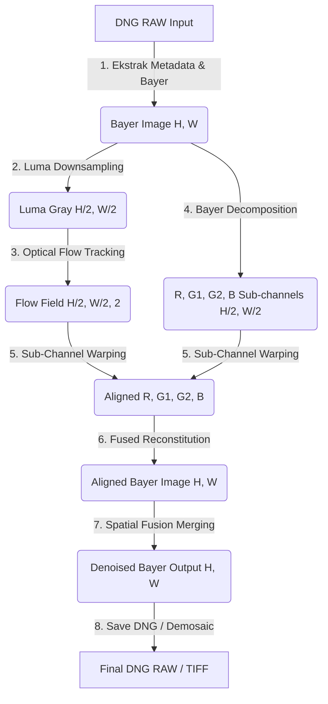

# Cetak Biru (Blueprint) & Rencana Implementasi: End-to-End RAW Bayer Processing di GPU

Dokumen ini mendokumentasikan rencana teknis dan cetak biru (blueprint) berurutan untuk memindahkan seluruh rangkaian proses penyelarasan gambar (*alignment*) dan peleburan spasial (*spatial fusion*) sepenuhnya ke dalam **Domain RAW Bayer Asli** (piksel sensor mentah sebelum interpolasi demosaicing). 

Pendekatan ini setara dengan arsitektur pemrosesan HDR+ modern untuk menghasilkan kualitas citra murni tanpa adanya amplifikasi noise warna (*color noise bleeding*) dan hilangnya detail spasial mikro.

---

## 📖 Kamus Istilah Teknis (Glossary)

* **Bayer Pattern (Mosaik RGGB/BGGR)**: Pola filter warna spasial pada sensor fisik kamera di mana setiap piksel berukuran $2\times2$ hanya menangkap 1 warna primer (contoh RGGB: Merah, Hijau 1, Hijau 2, Biru).
* **Bayer Decomposition**: Proses memisahkan gambar Bayer tunggal beresolusi penuh `(H, W)` ke dalam 4 sub-saluran independen beresolusi setengah `(H/2, W/2)` berdasarkan tipe sensor fisiknya (Red, Green1, Green2, Blue) untuk menghindari pencampuran piksel warna yang berbeda selama interpolasi spasial.
* **Sub-Channel Warping**: Proses penyelarasan koordinat spasial (warp/remap) yang dilakukan secara independen dan simultan pada masing-masing 4 sub-saluran di GPU, guna mencegah kerusakan susunan mosaik warna.
* **Fused Reconstitution**: Proses menggabungkan kembali 4 sub-saluran yang telah selaras (`H/2, W/2`) kembali ke format mosaik Bayer tunggal beresolusi penuh `(H, W)` di memori GPU.
* **Bayer-Domain Fusion**: Akumulasi bobot spasial untuk penggabungan citra yang dilakukan langsung pada nilai piksel sensor mentah terkompresi sebelum *demosaicing*, guna menghasilkan berkas output akhir berupa **DNG RAW Bersih (Denoised)**.

---

## 📐 Arsitektur Blueprint (Langkah demi Langkah)

Proses end-to-end ini akan berjalan secara efisien pada GPU menggunakan **Taichi AOT (Vulkan/CUDA)** dengan urutan logis sebagai berikut:

### 1. Tahap 1: Ekstraksi RAW & Pembuatan Panduan Luma (CPU ke GPU)
* Membaca berkas DNG mentah tanpa post-processing (menggunakan `rawpy` / `tifffile` secara instan) untuk mengambil bayer array `(H, W)` 16-bit.
* Unggah gambar Bayer ke VRAM GPU sebagai `TaichiGPUBuffer` satu saluran.
* **Luma Downsampling**: Di dalam GPU, setiap blok $2\times2$ piksel sensor (RGGB) diringkas (dirata-rata) menjadi 1 piksel grayscale luma `(H/2, W/2)` kontinu. Grayscale luma ini kemudian digunakan sebagai panduan pelacakan aliran optik.

### 2. Tahap 2: Estimasi Aliran Optik (`compute_flow`)
* Menjalankan algoritma `compute_flow` terakselerasi AOT pada tingkat grayscale luma `(H/2, W/2)` untuk mendapatkan peta vektor aliran spasial (optical flow field) sub-piksel dengan performa maksimal dan presisi tinggi.

### 3. Tahap 3: Pipeline Bayer Split-Warp-Merge (Hot-Path GPU)
* **Split**: Kernel Taichi memecah berkas Bayer mentah `(H, W)` piksel sensor ke dalam 4 buffer sub-saluran terpisah `(H/2, W/2)`: $R, G_1, G_2, B$.
* **Warp (Sub-Channel Remap)**: Melakukan penyelarasan spasial (warp) secara terpisah pada masing-masing 4 sub-saluran di GPU menggunakan peta aliran koordinat yang disesuaikan skala dimensinya (dibagi 2). Interpolasi bilinear spasial aman dilakukan di sini karena piksel antar warna tidak saling bercampur.
* **Merge (Reconstitution)**: Menyatukan kembali keempat sub-saluran yang telah selaras kembali ke dalam mosaik Bayer tunggal beresolusi penuh `(H, W)`.

### 4. Tahap 4: Peleburan Spasial Bayer (`compute_spatial` di Domain RAW)
* Jalankan algoritma akumulasi peleburan spasial (`compute_spatial` / `accumulate_spatial_merging`) langsung pada citra susunan Bayer mentah `(H, W)` yang telah diselaraskan.
* Proses akumulasi ini akan mereduksi noise tingkat sensor secara ekstrem dan menghasilkan citra Bayer keluaran ter-fusion yang super bersih.

### 5. Tahap 5: Output DNG RAW Bersih & Demosaicing Akhir
* Citra Bayer hasil fusion dari GPU VRAM ditulis langsung ke format berkas **DNG (RAW) baru** yang bersih menggunakan metadata DNG asli (seperti Black/White level, Camera Matrix, WB Gains).
* Hanya setelah seluruh rangkaian pembersihan RAW ini selesai, citra dapat didevelop / didecode menjadi TIFF 16-bit atau dikonversi secara on-the-fly untuk ditampilkan di monitor.

---

## 🛠 Rencana Perubahan Kode (Draft)

### 1. Modul Taichi Baru: `taichi_algorithm/bayer_pipeline.py`
Menambahkan kernel Taichi untuk pembelahan dan penyusunan kembali Bayer mosaik:
* `@ti.kernel def split_bayer_kernel(...)`
* `@ti.kernel def merge_bayer_kernel(...)`
* `@ti.kernel def downsample_bayer_to_luma_kernel(...)`

### 2. Integrasi AOT Compiler: `compile_bayer_tcm.py`
* Mengompilasi fungsi-fungsi bayer baru ini ke dalam AOT biner `.tcm` untuk Vulkan, CUDA, dan CPU.

### 3. Modifikasi Bridge Penyelarasan: `taichi_bridge.py` & `alignment_core.py`
* Menambahkan mode pelacakan `bayer_domain` yang memanggil interpolasi luma dan memproses Split-Warp-Merge terakselerasi GPU pada hot-path penyelarasan frame.

---

## 🧪 Rencana Verifikasi

### Pengujian Konsep (Proof of Concept)
* **Membuat Skrip Pengujian**: [test_bayer_pipeline_proof.py](file:///e:/APP%20Developer/Pixel%20Refine/scratch/test_bayer_pipeline_proof.py)
  - Memuat gambar DNG sensor mentah.
  - Memecah susunan sensor menjadi sub-saluran, melakukan warp dengan pergeseran sub-piksel buatan, menggabungkannya kembali, dan memverifikasi keselarasan mosaik RGGB piksel sensor.
  - Membandingkan hasil rekonstruksi warna demosaicing untuk memastikan **nol degradasi visual (zero color-bleeding)**.
