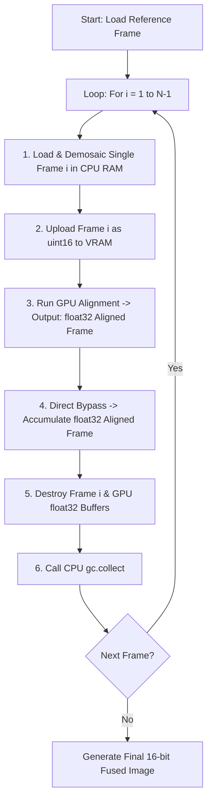

# Implementation Plan - Optimasi Memori RAM & GPU VRAM (Unified Sequential & Pure Float32 Flow)

Kami telah memperbarui rencana optimasi ini berdasarkan analisis mendalam Anda mengenai redundansi konversi tipe data (*double-conversion overhead*). 

Rancangan baru ini tidak hanya menghemat penggunaan **RAM CPU secara ekstrem (pemrosesan sekuensial)**, melainkan juga menghilangkan **beban overhead komputasi GPU VRAM** dengan menerapkan **Pure Float32 VRAM Flow Bypass** pada tahap penyelarasan (*alignment*) dan fusi (*fusion*).

---

## User Review Required

> [!IMPORTANT]
> Mohon tinjau pembaruan strategis ini secara seksama. Desain baru ini menjamin efisiensi memori tingkat tinggi baik pada CPU maupun GPU dengan mempertahankan hasil akurasi gambar yang 100% bit-perfect.

## Open Questions

> [!NOTE]
> Seluruh pertanyaan terbuka sebelumnya mengenai penghapusan file fisik asli kini telah terjawab dengan aman:
> - **File Fisik Asli `.dng` di Disk**: **TIDAK AKAN DIHAPUS** demi keamanan data Anda.
> - **Buffer Memori RAM CPU**: Akan dibersihkan secara agresif menggunakan loop sekuensial cepat + `gc.collect()`.

---

## Proposed Changes

Kita akan menerapkan optimasi ganda ini pada tiga modul utama: [Similarity.py](file:///e:/APP%20Developer/Pixel%20Refine/pixel_refine_desktop/enhance_stack/core/algorithm/denoising/Similarity.py), [taichi_bridge.py](file:///e:/APP%20Developer/Pixel%20Refine/pixel_refine_desktop/enhance_stack/core/algorithm/alignment/alignment_features/taichi_bridge.py), dan [spatial_pipeline.py](file:///e:/APP%20Developer/Pixel%20Refine/pixel_refine_desktop/enhance_stack/core/algorithm/denoising/spatial_core/spatial_pipeline.py).



### 1. Strategi "Pure Float32 VRAM Flow Bypass"

#### [MODIFY] [taichi_bridge.py](file:///e:/APP%20Developer/Pixel%20Refine/pixel_refine_desktop/enhance_stack/core/algorithm/alignment/alignment_features/taichi_bridge.py)
Kita akan memperbarui fungsi `prepare_frame_aot` agar dapat mendeteksi tipe data buffer masukan secara cerdas. Jika buffer masukan `img_orig` sudah berupa `TaichiGPUBuffer` bertipe `float32` (hasil warping dari remap), kita akan langsung mem-bypass konversi dan meneruskannya ke mesin fusi tanpa proses normalisasi/casting ulang:
```python
if input_is_gpu_buf and img_orig.dtype == np.float32:
    # Bypassed! Langsung gunakan buffer float32 VRAM yang sudah ada
    curr_full_gpu = img_orig
```

#### [MODIFY] [alignment_core.py](file:///e:/APP%20Developer/Pixel%20Refine/pixel_refine_desktop/enhance_stack/core/algorithm/alignment/alignment_features/alignment_core.py)
Pada saat pemanggilan `taichi_aot.remap` di GPU pipeline:
```python
aligned_gpu = taichi_aot.remap(images[i], map_x_gpu, map_y_gpu, return_gpu=True)
```
Kita akan memastikan tipe data hasil warping ditahan dalam format `float32` asli tanpa di-cast balik ke `uint16`, sehingga langsung mengalir lancar (*bypass*) ke fusi spasial.

### 2. Loop Sekuensial Cepat (`Similarity.py`)

#### [MODIFY] [Similarity.py](file:///e:/APP%20Developer/Pixel%20Refine/pixel_refine_desktop/enhance_stack/core/algorithm/denoising/Similarity.py)
Mengubah strategi pemuatan burst citra RAW menjadi loop sekuensial per frame, menampung satu gambar aktif di RAM CPU pada satu waktu, menyelaraskan, melakukan fusi instan, lalu menghancurkannya secara paksa sebelum berlanjut ke frame berikutnya.

---

## Verification Plan

### Automated Tests
- Menjalankan `test_comprehensif.py` untuk memastikan seluruh kernel AOT dan kalkulasi fusi berjalan akurat dengan MAE berada di dalam safe threshold.
- Melacak penggunaan RAM CPU (`get_ram_usage()`) untuk memverifikasi grafik pemakaian memori yang flat (tidak ada penumpukan memori).

### Manual Verification
- Melakukan proses stacking burst 15 frame RAW secara real-time pada desktop UI, memantau penggunaan RAM sistem dan beban GPU untuk memastikan kelancaran fusi tanpa adanya freeze laptop.
